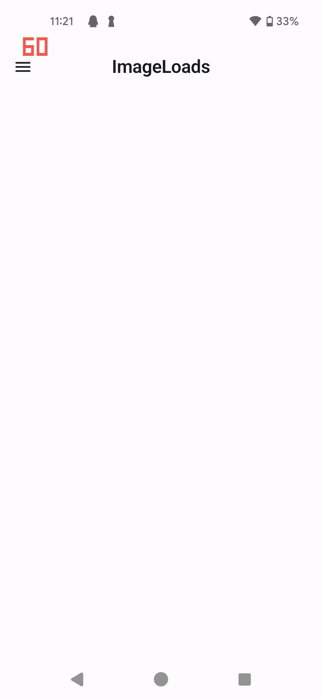
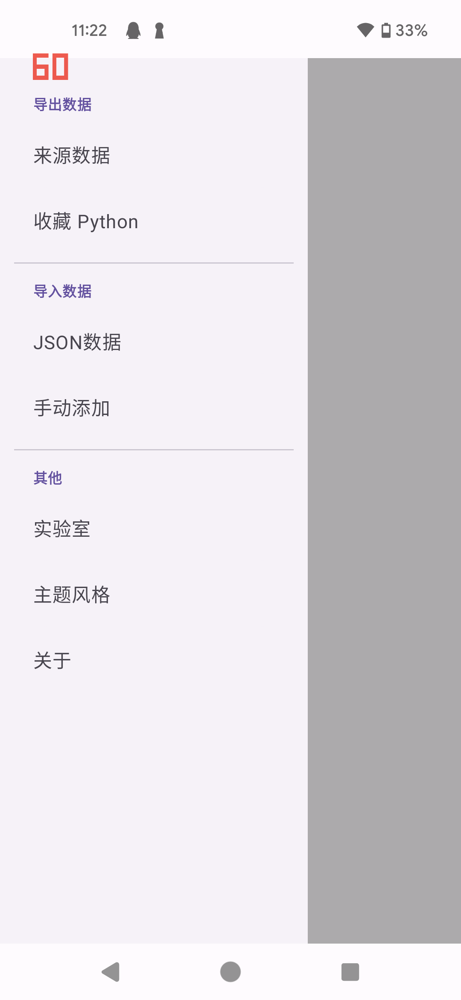
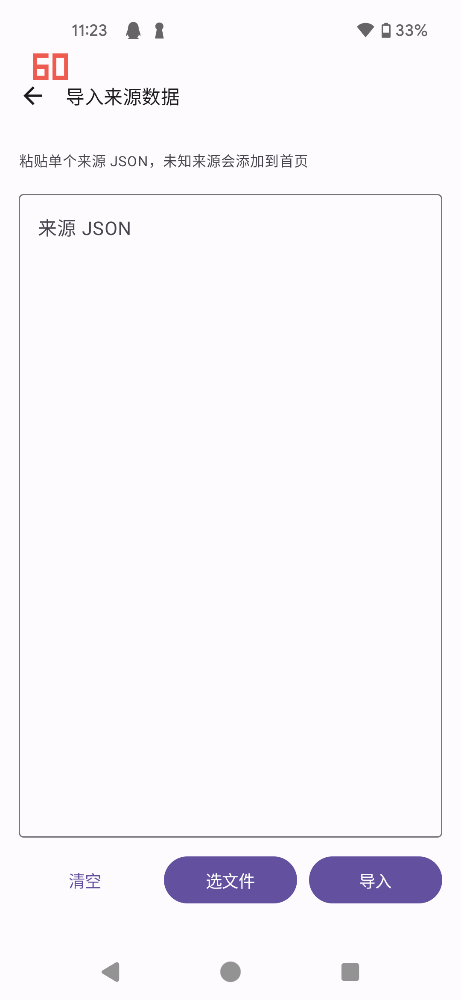
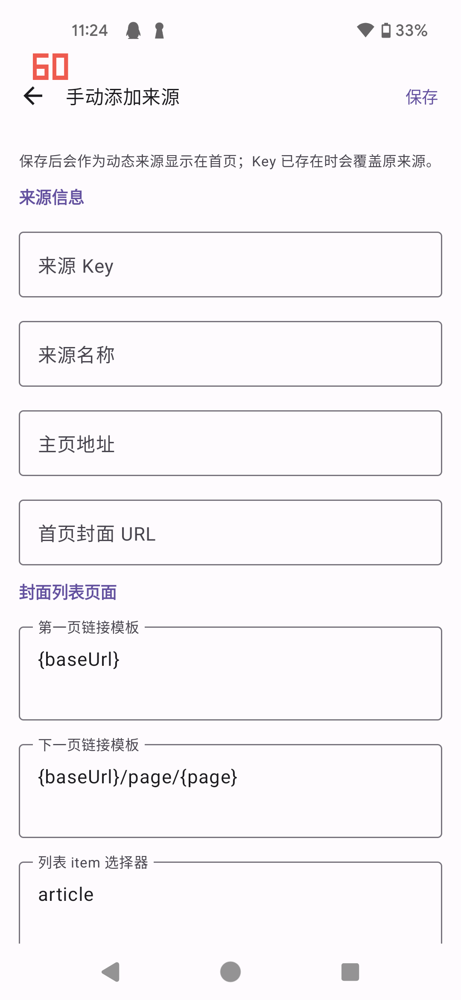
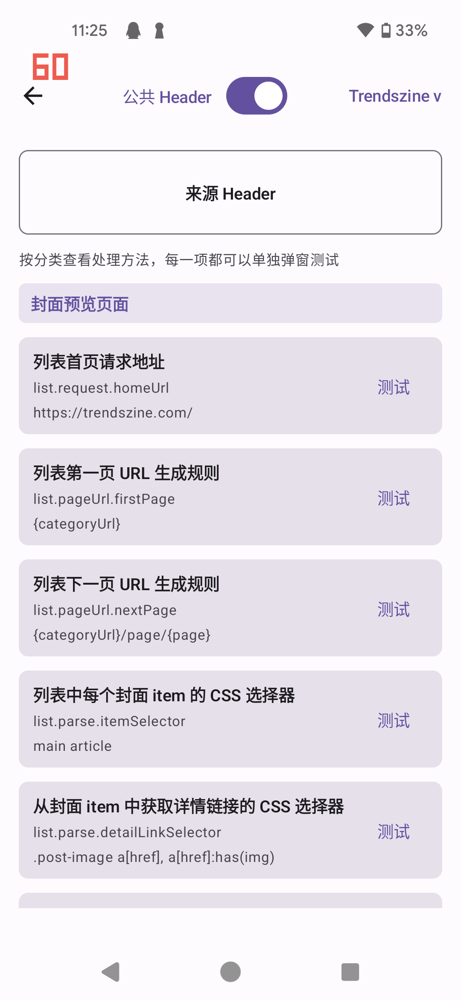
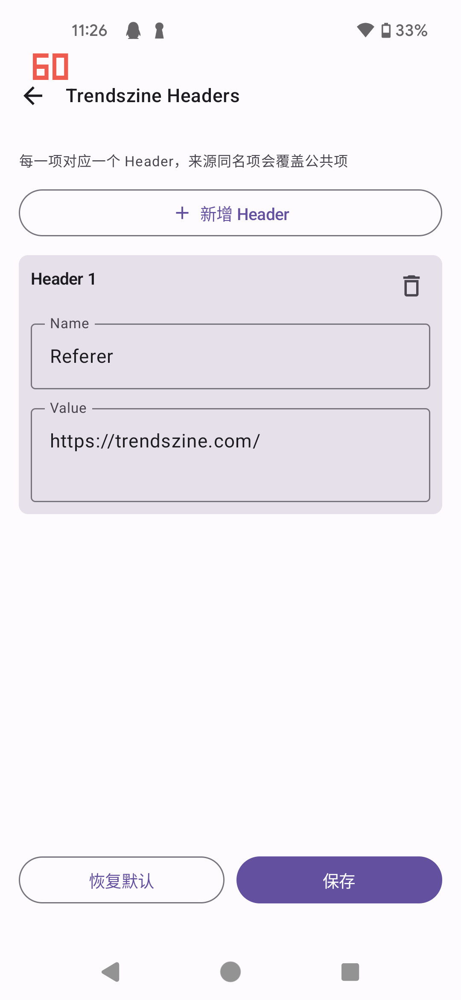

# ImageLoads App 使用说明

ImageLoads 是一个按“来源”浏览图片列表、查看详情、收藏和下载整组图片的 Android App。当前版本的首页主要展示已经导入或手动添加的动态来源；如果首页为空，需要先导入来源 JSON，或通过“手动添加”创建来源。

## 首次使用

1. 打开 App 后进入首页。
2. 如果首页没有来源，点击左上角菜单，选择“导入数据”下的“JSON数据”或“手动添加”。
3. 需要浏览网络内容时，确认设备网络可用。
4. 需要下载图片时，按系统提示授予存储权限。Android 11 及以上可能需要授予“管理所有文件”权限。



## 首页

首页每张来源卡片代表一个图片来源。

- 点击封面或“打开”：进入该来源的图片列表。
- 点击爱心按钮：进入该来源的收藏列表。
- 点击下载按钮：查看该来源已经下载到本机的图片分组。
- “本地 / 网络”：切换列表和详情数据来源。
- “公共 Header”：控制该来源请求网络时是否合并公共 Header。
- 删除按钮：删除该来源定义、收藏记录和本地 HTML 缓存；已经下载到公共目录的图片不会被删除。

“本地”模式会优先读取 App 已缓存的 HTML。如果本地没有对应缓存，会自动回退到网络加载并缓存结果。



## 导入来源

点击首页左上角菜单，在“导入数据”中选择：

- “JSON数据”：粘贴来源 JSON，或点击“选文件”选择 `.json` 文件，然后点击“导入”。
- “手动添加”：填写来源 Key、名称、主页地址、封面 URL，以及列表页、详情页的 CSS 选择器配置，保存后会出现在首页。

手动添加时注意：

- 来源 Key 会被规范化为小写，只保留字母、数字、下划线和短横线。
- 不能覆盖内置来源 Key，例如 `trendszine`、`meizi5`、`taotu`、`xiuren`。
- 主页地址必须以 `http://` 或 `https://` 开头。
- Key 已存在时会覆盖原来源配置。

<p>
  
  
</p>

## 浏览图片列表

进入来源后，App 会显示双列瀑布流图片列表。

- 下滑接近底部时会自动加载下一页。
- 右上角更多菜单可“打开网页”或“跳转页码”。
- 如果来源配置了分类，顶部会显示分类选择器。
- 点击图片进入详情页。
- 点击图片上的爱心可加入或取消收藏。

## 详情页

详情页会解析并展示当前图集的全部图片。

- 顶部标题会随当前浏览位置显示图片序号。
- 点击图片可进入大图预览。
- 点击爱心可收藏或取消收藏当前图集封面。
- 点击“下载”会下载当前详情中的图片；如果该图集已经下载过，会提示是否覆盖。
- 如果详情存在分页，App 会在浏览到底部或下载时继续加载后续分页，最多加载 50 页。

## 收藏和批量下载

在首页点击来源卡片的爱心按钮，或在来源列表右上角菜单选择“收藏”，可进入收藏列表。

- 收藏列表只显示已收藏的图集。
- 单个收藏项的下载按钮可下载该图集。
- 顶部下载按钮可批量下载全部未下载收藏。
- 已下载过的收藏会被识别并跳过；单条下载已下载内容时会提示是否覆盖。
- 下载过程中返回会提示“正在下载中”，避免中断状态。

## 已下载管理

首页点击来源卡片的下载按钮可查看本机已下载内容。

- 已下载内容按图集目录分组展示。
- 点击分组可查看该组内图片。
- 删除分组会直接删除本地文件，请谨慎操作。

## 导出和备份

点击首页左上角菜单，在“导出数据”中选择：

- “来源数据”：导出当前来源 JSON。默认包含来源定义和列表设置，可开启“一起导出收藏”把收藏记录也写入 JSON。
- “收藏 Python”：根据收藏详情链接和处理方法生成 Python 下载脚本，可复制或导出 `.py` 文件。

导出的来源文件名格式为：

- `imageloads_source_{sourceKey}.json`
- `imageloads_favorites_{sourceKey}.py`

导入 JSON 时当前实现一次只导入一个来源。

## 实验室和 Header 设置

首页左上角菜单中的“实验室”用于调试来源。

- 可切换来源，查看该来源的处理方法。
- 点击“来源 Header”可编辑当前来源的请求 Header。
- 点击“公共 Header”可编辑公共 Header。
- 公共 Header 默认包含 User-Agent、Accept、Accept-Language。
- 来源 Header 中同名项会覆盖公共 Header。
- 每项处理方法可以单独测试，适合排查列表或详情解析失败的问题。

<p>
  
  
</p>

如果图片或页面加载失败，优先检查：

1. 来源网页是否能在浏览器正常打开。
2. Header 中的 `Referer`、`User-Agent` 是否符合目标网站要求。
3. 处理方法中的 CSS selector 是否仍匹配页面结构。
4. 当前是否误切到“本地”模式且本地缓存为空或过旧。

## 其他菜单

- “主题风格”：切换 App 的整体配色风格。
- “关于”：查看当前 App 版本号。

## 本地文件位置

下载图片保存到公共存储：

```text
/storage/emulated/0/ImageLoads/download/{sourceKey}/detail/{图集标题}/
```

App 缓存的 HTML 保存到应用外部私有目录：

```text
/storage/emulated/0/Android/data/com.zasko.imageloads/files/html/{sourceKey}/
```

下载记录用于识别图集是否已下载，保存在 App 私有目录中。删除首页来源不会删除公共下载目录中的图片；在“已下载”页面删除分组会删除对应本地图片文件。

## 常见问题

### 首页为空

当前版本首页依赖已保存的动态来源。请从左上角菜单导入来源 JSON，或使用“手动添加”创建来源。

### 列表能打开但详情没有图片

通常是详情页选择器不匹配，或目标网站图片地址在其他属性中。进入“实验室”测试详情相关处理方法，重点检查详情内容容器、详情图片选择器、图片 URL 属性顺序、原图链接选择器。

### 下载失败

先确认已经授予存储权限，再检查网络和 Header。部分站点要求正确的 `Referer` 或 `User-Agent`。

### 本地模式没有内容

本地模式依赖之前网络加载时缓存下来的 HTML。先切到“网络”加载一次，再切回“本地”。
